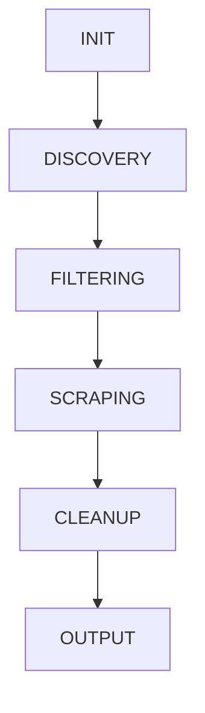

## Pipeline Overview

Every Docrawl job executes through a 6-phase pipeline orchestrated by `src/jobs/runner.py`. The pipeline is sequential, with each phase completing before the next begins. Real-time progress is streamed via Server-Sent Events (SSE).



<Note>
  The pipeline can be paused at any phase and resumed later. State is checkpointed after each page is processed.
</Note>

## Phase 1: INIT

<Steps>
  <Step title="Validate models">
    Verifies that all three required models are available:
    
    - **crawl_model**: Used for LLM-based URL filtering
    - **pipeline_model**: Used for markdown cleanup
    - **reasoning_model**: Reserved for future site structure analysis
    
    For Ollama models, checks exact match or base model name (e.g., `mistral:7b` or `mistral:latest`). For API providers (OpenRouter, OpenCode), verifies connectivity.
    
    **Failure behavior**: Job fails immediately if any model is unavailable.
  </Step>
  
  <Step title="Start Playwright browser">
    Launches headless Chromium browser via Playwright. If `PAGE_POOL_SIZE > 0`, the browser is pre-initialized during application startup and reused across jobs.
    
    **Configuration**:
    ```bash
    PAGE_POOL_SIZE=5  # Default: 5 pre-warmed pages
    PAGE_POOL_SIZE=0  # Disable pool (create pages on-demand)
    ```
  </Step>
  
  <Step title="Load robots.txt">
    If `respect_robots_txt=true` (default), fetches and parses `{base_url}/robots.txt`.
    
    **Supported directives**:
    - `Disallow`: Paths blocked for the user-agent
    - `Crawl-delay`: Minimum delay between requests (seconds)
    - `Sitemap`: Sitemap URL hint for discovery phase
    
    **Known limitation**: `Allow` directive not yet supported.
    
    The crawler uses the maximum of `delay_ms` and robots.txt `crawl-delay`.
  </Step>
</Steps>

### Configuration Parameters

| Parameter | Default | Description |
|-----------|---------|-------------|
| `respect_robots_txt` | `true` | Whether to honor robots.txt rules |
| `delay_ms` | `500` | Minimum delay between requests (100-60000 ms) |

## Phase 2: DISCOVERY

URL discovery runs three strategies **in parallel** and merges results. The first successful strategy provides the URL list; if all fail, an empty list is returned.

<Steps>
  <Step title="Strategy 1: Sitemap Parsing">
    Attempts to find and parse XML sitemaps:
    
    1. Check `{base_url}/sitemap.xml`
    2. Check robots.txt `Sitemap:` directive
    3. Handle sitemap index files (nested sitemaps)
    4. Support gzip-compressed sitemaps
    5. Extract `<loc>` URLs from `<url>` or `<sitemap>` entries
    
    **Features**:
    - Caching to avoid redundant fetches
    - Recursive parsing for sitemap indexes
    - defusedxml for XXE attack prevention
    
    **Optional filtering**: If `filter_sitemap_by_path=true`, only includes URLs matching the base URL path.
  </Step>
  
  <Step title="Strategy 2: Nav Parsing">
    Uses Playwright to render the base URL and extract links from navigation elements:
    
    **Selectors searched** (in order):
    - `nav`
    - `aside`
    - `[role="navigation"]`
    - `.sidebar`
    - `#sidebar`
    - `.docs-nav`
    - `.documentation-nav`
    
    Extracts all `<a href>` links within these elements. Useful for JS-rendered documentation sites where sitemaps are missing.
  </Step>
  
  <Step title="Strategy 3: Recursive BFS Crawl">
    Breadth-first search starting from the base URL:
    
    - **Depth limit**: Configurable via `max_depth` (1-20, default 5)
    - **URL cap**: Stops at 1000 discovered URLs
    - **Parallel per depth**: All URLs at depth N are fetched concurrently before moving to depth N+1
    - **Same-domain enforcement**: Only follows links within the same domain and path prefix
    
    **Use case**: Fallback for sites without sitemaps or detectable navigation.
  </Step>
</Steps>

### Post-Discovery Processing

All discovered URLs undergo:

1. **Normalization**: Remove fragments, sort query params, decode percent-encoding
2. **Same-domain filter**: Must match base URL domain
3. **Deduplication**: Remove exact duplicates
4. **SSRF validation**: Block private/reserved IP ranges

### Configuration Parameters

| Parameter | Default | Description |
|-----------|---------|-------------|
| `max_depth` | `5` | Maximum crawl depth for recursive strategy (1-20) |
| `filter_sitemap_by_path` | `true` | Filter sitemap URLs to match base path |

## Phase 3: FILTERING

Filtering narrows the discovered URLs to documentation pages through three sub-phases:

<Steps>
  <Step title="Deterministic Filtering">
    Rule-based heuristics in `src/crawler/filter.py`:
    
    **Extension blocklist**:
    ```python
    .pdf, .zip, .tar, .gz, .exe, .dmg, .pkg,
    .png, .jpg, .jpeg, .gif, .svg, .ico,
    .mp4, .mov, .avi, .webm,
    .json, .xml, .csv
    ```
    
    **Pattern blocklist**:
    ```python
    /blog/, /changelog/, /releases/, /release-notes/,
    /privacy/, /terms/, /legal/, /about/,
    /careers/, /jobs/, /press/,
    /api/v, /v1/, /v2/, /v3/  # API endpoints, not docs
    ```
    
    **Language filtering**: If `language` is specified (default: `en`), keeps only URLs matching the language code.
    
    **Supported languages**: `en`, `es`, `fr`, `de`, `ja`, `zh`, `pt`, `ru`, `ko`
    
    **Same-domain + subpath enforcement**: Removes URLs outside the base URL's path prefix.
  </Step>
  
  <Step title="robots.txt Filtering">
    If `respect_robots_txt=true`, removes URLs blocked by `Disallow` rules.
    
    **Example**:
    ```robotstxt
    User-agent: *
    Disallow: /admin/
    Disallow: /internal/
    ```
    
    URLs matching `/admin/*` or `/internal/*` are excluded.
  </Step>
  
  <Step title="LLM Filtering">
    Uses the `crawl_model` to classify remaining URLs as documentation vs non-documentation.
    
    **How it works**:
    - URLs are batched and sent to the LLM
    - The model receives URL paths and must classify each
    - Non-documentation URLs (e.g., marketing pages, support portals) are removed
    
    **Why needed**: Catches non-documentation pages that pass deterministic filters (e.g., `/community/`, `/resources/`).
    
    **Performance**: Batched requests minimize API calls. Typical processing time: 1-3 seconds for 100 URLs.
  </Step>
</Steps>

### Configuration Parameters

| Parameter | Default | Description |
|-----------|---------|-------------|
| `language` | `"en"` | Language code for URL filtering |
| `crawl_model` | Required | LLM model for URL classification |

## Phase 4: SCRAPING

Scraping processes filtered URLs concurrently (controlled by `max_concurrent`) using the [5-level fallback chain](/advanced/scraping-fallbacks).

<Steps>
  <Step title="Concurrent Processing">
    All URLs are launched concurrently via `asyncio.gather()`, but `asyncio.Semaphore` limits actual parallelism:
    
    ```python
    sem = asyncio.Semaphore(request.max_concurrent)  # Default: 3
    async with sem:
        # Fetch and process page
    ```
    
    **Delay**: After each page, the worker sleeps for `delay_ms` (or robots.txt `crawl-delay`).
  </Step>
  
  <Step title="5-Level Fallback Chain">
    Each URL attempts scraping through 5 levels. See [Scraping Fallbacks](/advanced/scraping-fallbacks) for details:
    
    1. **Cache**: Disk cache hit (if `use_cache=true`)
    2. **Native Markdown**: `Accept: text/markdown` content negotiation
    3. **Proxy Markdown**: markdown.new or r.jina.ai
    4. **HTTP Fast-path**: Plain httpx + markdownify (≥500 chars)
    5. **Playwright**: Full browser render + DOM cleaning
  </Step>
  
  <Step title="Post-Scrape Checks">
    After fetching markdown, two validation checks run:
    
    **Bot-check detection** (`is_blocked_response`):
    - Detects captcha/bot-check pages by searching for indicators: "captcha", "cloudflare", "Access Denied"
    - Blocked pages are skipped and logged as warnings
    
    **Content deduplication** (`content_hash`):
    - Computes SHA-256 hash of the markdown
    - If hash matches a previously seen page, skip (duplicate content)
    - Useful for handling redirects or mirrored content
  </Step>
  
  <Step title="Markdown Chunking">
    Long markdown is split into chunks for LLM processing:
    
    - **Chunk size**: 16,000 tokens (estimated at 4 chars/token adjusted for code density)
    - **Boundary respect**: Chunks break at heading boundaries when possible
    - **Overlap**: Small overlap between chunks to preserve context
    
    **Why chunk**: LLM context windows are limited. Chunking ensures all content fits while preserving document structure.
  </Step>
</Steps>

### Configuration Parameters

| Parameter | Default | Description |
|-----------|---------|-------------|
| `max_concurrent` | `3` | Concurrent page fetches (1-10) |
| `delay_ms` | `500` | Delay between requests per worker (100-60000 ms) |
| `use_native_markdown` | `true` | Enable native markdown content negotiation |
| `use_markdown_proxy` | `false` | Enable proxy markdown services |
| `markdown_proxy_url` | `null` | Custom proxy URL (default: https://markdown.new) |
| `use_http_fast_path` | `true` | Try plain HTTP before Playwright |
| `use_cache` | `false` | Enable 24h disk cache |
| `converter` | `null` | Converter plugin name (null = markdownify) |

## Phase 5: CLEANUP

LLM-based markdown cleanup runs per chunk using the `pipeline_model`. The cleanup logic is **skipped entirely** if `output_format=json` (structured output preserves raw content).

<Steps>
  <Step title="Classification">
    Each chunk is classified into one of three levels:
    
    **skip** (no LLM call):
    - Code density &gt;60%
    - Short text &lt;2000 chars without noise indicators
    
    **cleanup** (standard prompt):
    - Standard documentation with nav residue, footers, breadcrumbs
    - Removes: navigation menus, footers, ads, broken formatting
    - Preserves: all documentation content, code blocks, links
    
    **heavy** (extended prompt):
    - Contains broken Markdown tables (missing separator rows)
    - Contains LaTeX expressions (`\frac`, `\begin`, `$...$`)
    - Repairs table structure and fixes math notation
  </Step>
  
  <Step title="Dynamic Timeout">
    Timeout is calculated based on content size:
    
    ```python
    BASE_TIMEOUT = 45  # seconds
    TIMEOUT_PER_KB = 10  # extra seconds per KB
    MAX_TIMEOUT = 90  # cap
    
    timeout = min(BASE_TIMEOUT + (size_kb * TIMEOUT_PER_KB), MAX_TIMEOUT)
    ```
    
    **Rationale**: Large chunks need more LLM processing time. Dynamic timeouts prevent false failures.
  </Step>
  
  <Step title="Adaptive Context Window">
    The LLM context window (`num_ctx`) is sized to actual content:
    
    ```python
    token_estimate = len(chunk) / chars_per_token
    num_ctx = token_estimate + 1024  # +1024 for prompt/response
    ```
    
    **chars_per_token** adjusts based on code density:
    - High code (&gt;40%): 3.0 chars/token
    - Medium code (20-40%): 3.5 chars/token
    - Low code (&lt;20%): 4.0 chars/token
    
    **Rationale**: Code is more token-dense than prose. Accurate estimates prevent context overflow.
  </Step>
  
  <Step title="Exponential Backoff Retry">
    If an LLM call fails, retry up to 3 times with exponential backoff:
    
    - Attempt 1: immediate
    - Attempt 2: wait 1 second
    - Attempt 3: wait 2 seconds
    - Attempt 4: wait 4 seconds (final)
    
    After 3 failures, the raw (uncleaned) chunk is used.
  </Step>
  
  <Step title="XML Input Wrapping">
    The scraped markdown is wrapped in XML tags before being sent to the LLM:
    
    ```xml
    <scraped_content>
    {markdown}
    </scraped_content>
    ```
    
    **Rationale**: Isolates user-generated content from the prompt, mitigating prompt injection attacks.
  </Step>
</Steps>

### Configuration Parameters

| Parameter | Default | Description |
|-----------|---------|-------------|
| `pipeline_model` | Required | LLM model for markdown cleanup |
| `output_format` | `"markdown"` | `"markdown"` or `"json"` (json skips cleanup) |

## Phase 6: OUTPUT

The final phase writes cleaned content to disk in the requested format.

<Steps>
  <Step title="Markdown Output (default)">
    Each URL is saved as a `.md` file preserving the URL path structure:
    
    **Example**:
    ```
    https://docs.example.com/getting-started/installation
    → output/getting-started/installation.md
    ```
    
    **Atomic write**: Uses `.tmp` → `os.replace()` to prevent corruption from crashes.
    
    **Index generation**: Creates `_index.md` with a table of contents linking all pages.
  </Step>
  
  <Step title="JSON Output (structured)">
    If `output_format=json`, saves as `.json` with structured blocks:
    
    ```json
    {
      "metadata": {
        "url": "https://docs.example.com/api",
        "title": "API Reference",
        "timestamp": "2026-03-10T12:34:56Z",
        "model": "mistral:latest"
      },
      "navigation": [...],
      "content": "# API Reference\n\n...",
      "code_blocks": [{"language": "python", "code": "..."}],
      "tables": [...],
      "links": [{"text": "Home", "href": "/"}],
      "media": [{"type": "image", "src": "...", "alt": "..."}]
    }
    ```
    
    **Benefits**:
    - Preserves document structure for programmatic processing
    - No LLM cleanup (faster, cheaper)
    - Ideal for re-indexing or custom post-processing
  </Step>
  
  <Step title="Checkpoint Save">
    After each page is written, the job state is checkpointed to `.job_state.json`:
    
    ```json
    {
      "job_id": "abc123",
      "request": {...},
      "completed_urls": ["..."],
      "failed_urls": ["..."],
      "pending_urls": ["..."]
    }
    ```
    
    **Atomic write**: Uses `.tmp` → `os.replace()` for crash safety.
    
    **Resume**: The `/api/jobs/{id}/resume` endpoint reads this file and creates a new job processing only pending URLs.
  </Step>
</Steps>

### Configuration Parameters

| Parameter | Default | Description |
|-----------|---------|-------------|
| `output_path` | `"/data/output"` | Output directory (must be under `/data`) |
| `output_format` | `"markdown"` | `"markdown"` or `"json"` |

## Pipeline Metrics

At job completion, the following metrics are emitted via SSE:

| Metric | Description |
|--------|-------------|
| `pages_ok` | Pages successfully scraped and cleaned |
| `pages_partial` | Pages with some chunks failed (used raw fallback) |
| `pages_failed` | Pages that failed entirely |
| `pages_skipped` | Pages skipped due to duplicate content |
| `pages_blocked` | Pages skipped due to bot-check detection |
| `pages_native_md` | Pages fetched via native markdown |
| `pages_proxy_md` | Pages fetched via proxy markdown |
| `pages_http_fast` | Pages fetched via HTTP fast-path |
| `pages_playwright` | Pages fetched via Playwright |
| `cache_hits` | Cache hits (if `use_cache=true`) |
| `cache_misses` | Cache misses (if `use_cache=true`) |

## Pause/Resume

Jobs can be paused and resumed at any point:

**Pause**:
```bash
POST /api/jobs/{id}/pause
```

- Sets job status to `paused`
- Current page processing completes before pausing
- State is checkpointed to `.job_state.json`

**Resume**:
```bash
POST /api/jobs/{id}/resume
```

- Reads `.job_state.json`
- Creates a new job with only pending URLs
- Skips DISCOVERY and FILTERING phases (uses saved state)

<Note>
  Resume does not automatically trigger on server restart. You must manually call the resume endpoint.
</Note>

## Related Documentation

<CardGroup cols={2}>
  <Card title="System Architecture" icon="building" href="/advanced/architecture">
    High-level architecture and design decisions
  </Card>
  <Card title="Scraping Fallbacks" icon="layer-group" href="/advanced/scraping-fallbacks">
    Deep dive into the 5-level fallback chain
  </Card>
</CardGroup>