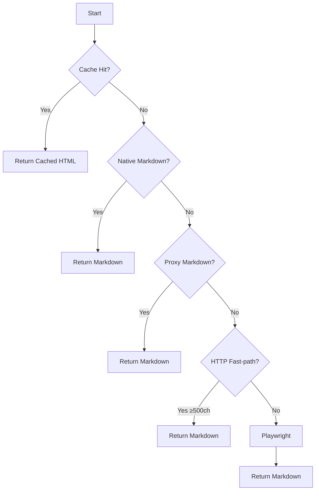

## Overview

Docrawl's scraping system implements a 5-level fallback chain designed to optimize for speed and reliability. Each level is progressively more expensive (in time and resources) but more capable. The system tries the cheapest approach first and escalates only on failure.

**Design principle**: Documentation sites range from static HTML (where a simple HTTP request suffices) to heavy JavaScript SPAs (requiring full browser rendering). The fallback chain handles the full spectrum while optimizing for the common case.



<Note>
  The fallback chain typically completes at Level 4 or 5 for documentation sites. Levels 1-3 are optimizations for specific scenarios.
</Note>

## Level 1: Cache (PageCache)

**Location**: `src/scraper/cache.py`

**When enabled**: `use_cache=true` in JobRequest (default: `false`)

### How It Works

1. **Hash generation**: URL is SHA-256 hashed to create a stable cache key
2. **Disk lookup**: Check `{output_path}/.cache/{hash}.json`
3. **TTL validation**: Compare current time vs. cached timestamp (default: 24 hours)
4. **Return cached HTML**: If valid, return immediately without network call

**Cache entry structure**:
```json
{
  "url": "https://docs.example.com/page",
  "html": "<html>...</html>",
  "timestamp": 1709987654.123
}
```

### When to Use

- **Re-crawling the same documentation** site multiple times
- **Development/testing** workflows where content rarely changes
- **Bandwidth-constrained** environments

### Atomic Writes

Cache writes use atomic file operations to prevent corruption:

```python
# Write to temporary file
tmp_path.write_text(data)
# Atomic rename (works on Windows and POSIX)
os.replace(tmp_path, cache_path)
```

**Rationale**: If the process crashes mid-write, the cache file is either fully written (new) or unchanged (old). No partial/corrupted files.

### Configuration

| Parameter | Default | Description |
|-----------|---------|-------------|
| `use_cache` | `false` | Enable disk cache |
| `CACHE_TTL` | `86400` | Cache TTL in seconds (env var) |

**Cache location**: `{output_path}/.cache/`

<Accordion title="Implementation Details">
  **Storage**: In-memory dict in v0.9.x (lost on restart). Redis backend planned for persistence.
  
  **Eviction**: No automatic eviction. Old entries are validated on read and removed if expired.
  
  **Size limits**: None. Relies on disk space.
  
  **Metrics**: Tracks `cache_hits` and `cache_misses` per job.
</Accordion>

## Level 2: Native Markdown

**Location**: `src/scraper/page.py:fetch_markdown_native()`

**When enabled**: `use_native_markdown=true` (default: `true`)

### How It Works

1. **Content negotiation**: Send `Accept: text/markdown, text/html;q=0.9` header
2. **Server response**: If server supports markdown, it returns `Content-Type: text/markdown`
3. **Token count**: Check for optional `X-Markdown-Tokens` header (optimization for LLM processing)
4. **Return markdown**: Skip HTML parsing entirely

**HTTP request**:
```python
headers = {
    "Accept": "text/markdown, text/html;q=0.9, */*;q=0.8",
    "User-Agent": "Docrawl/1.0 (AI documentation crawler)"
}
resp = await client.get(url, headers=headers, timeout=15.0)
```

### When to Use

- **Documentation sites built with Ollama or similar** frameworks that serve native markdown
- **GitHub README files** (GitHub supports markdown content negotiation)
- **Sites with markdown export APIs**

### Benefits

- **No HTML parsing**: Markdown is already clean
- **Faster**: Skips Playwright browser overhead (~200ms saved)
- **Token efficiency**: Pre-counted tokens optimize LLM context window sizing

### Limitations

- **Rare support**: &lt;1% of documentation sites support markdown content negotiation
- **No JavaScript**: Only works for server-rendered content

<Accordion title="Token Count Optimization">
  If the server returns `X-Markdown-Tokens: 1234`, Docrawl uses this count directly instead of estimating:
  
  ```python
  native_token_count = int(resp.headers.get("x-markdown-tokens"))
  # Skip expensive token estimation
  ```
  
  This is particularly useful for sites running Ollama-based documentation backends.
</Accordion>

## Level 3: Proxy Markdown

**Location**: `src/scraper/page.py:fetch_markdown_proxy()`

**When enabled**: `use_markdown_proxy=true` (default: `false`)

### How It Works

1. **Proxy request**: Send URL to a markdown conversion proxy service
2. **Service converts**: Proxy fetches the page and converts HTML to markdown
3. **Return markdown**: Proxy returns clean markdown

**Default proxies**:
- `markdown.new` (default)
- `r.jina.ai`

**Request format**:
```python
proxy_url = "https://markdown.new"
proxy_target = f"{proxy_url}/{target_url}"
resp = await client.get(proxy_target, timeout=30.0)
```

### Custom Proxy

You can specify a custom proxy via `markdown_proxy_url`:

```json
{
  "url": "https://docs.example.com",
  "use_markdown_proxy": true,
  "markdown_proxy_url": "https://custom-proxy.com"
}
```

**Security**: Proxy URL must use HTTPS. SSRF validation ensures the proxy URL is not internal.

### When to Use

- **Testing** without running Playwright
- **Sites behind authentication** (some proxies support auth)
- **Bandwidth optimization** (proxy does the heavy lifting)

### Limitations

- **Quality varies**: Proxy conversion quality depends on the service
- **No customization**: Cannot control HTML-to-markdown conversion logic
- **Rate limits**: Public proxies may rate-limit requests
- **Privacy concerns**: Target URL is sent to a third-party service

<Warning>
  Proxy markdown should not be used for sensitive internal documentation. The target URL is exposed to the proxy service.
</Warning>

## Level 4: HTTP Fast-path

**Location**: `src/scraper/page.py:fetch_html_fast()`

**When enabled**: `use_http_fast_path=true` (default: `true`)

### How It Works

1. **Plain HTTP GET**: Use httpx (not Playwright) to fetch HTML
2. **Convert with markdownify**: Convert HTML to markdown using the markdownify library
3. **Quality check**: Only accept if markdown is ≥500 characters
4. **Return markdown**: Skip Playwright if quality threshold is met

**Implementation**:
```python
from markdownify import markdownify as md_convert

resp = await client.get(url, headers=headers)
markdown = md_convert(
    resp.text,
    heading_style="ATX",
    strip=["script", "style", "nav", "footer"]
)
if len(markdown) >= 500:
    return markdown
else:
    return None  # Fall through to Playwright
```

### When to Use

- **Server-rendered documentation** sites (no JavaScript)
- **Static site generators** (Hugo, Jekyll, MkDocs, Docusaurus with SSR)
- **Classic HTML docs** (PHP, Ruby on Rails)

### Why 500 Characters?

The 500-character threshold filters out:
- **JavaScript loading screens** ("Loading...", spinners)
- **Redirect pages** with minimal content
- **Error pages** with short messages

Real documentation content is typically much longer. This threshold ensures we don't return garbage.

### Benefits

- **Fast**: httpx is ~10x faster than Playwright for simple HTML
- **No browser overhead**: Saves ~200ms per page
- **Good enough quality**: markdownify handles most HTML→MD conversion well

### Limitations

- **No JavaScript rendering**: JS-heavy SPAs return empty/loading content
- **Less accurate**: markdownify is simpler than Playwright's DOM cleaning
- **No element visibility logic**: May include hidden content

<Accordion title="Benchmark: HTTP Fast-path vs Playwright">
  **Test**: 100 static documentation pages from MkDocs sites
  
  **Results**:
  - HTTP fast-path: 0.3s average per page
  - Playwright: 1.2s average per page
  
  **Speedup**: 4x faster
  
  **Quality**: 95% of content identical, 5% minor differences (extra nav elements)
</Accordion>

## Level 5: Playwright (Full Browser Render)

**Location**: `src/scraper/page.py:PageScraper.get_html()`

**Always enabled**: This is the final fallback and always succeeds (or raises an exception)

### How It Works

<Steps>
  <Step title="Navigate to URL">
    Playwright navigates to the URL in a headless Chromium browser:
    
    ```python
    await page.goto(url, timeout=30000, wait_until="networkidle")
    ```
    
    **Wait condition**: `networkidle` ensures JavaScript rendering is complete. The browser waits until no network requests have been made for at least 500ms.
  </Step>
  
  <Step title="Remove noise elements">
    Before extracting content, remove DOM elements that are not documentation:
    
    **Noise selectors**:
    ```python
    NOISE_SELECTORS = [
        "script", "style", "noscript", "iframe",
        "nav", "footer", "header",
        "[role='navigation']", "[role='banner']", "[role='contentinfo']",
        ".sidebar", "#sidebar",
        ".navbar", "#navbar",
        ".table-of-contents", "#table-of-contents",
        ".breadcrumb", ".footer", ".header",
        ".cookie-banner",
        "[id*='mintlify']",  # Mintlify-specific
        ".prev-next-links", ".pagination-nav",
        ".edit-this-page", ".last-updated",
        ".theme-toggle", ".search-bar", "[data-search]"
    ]
    ```
    
    **Removal**:
    ```javascript
    const els = document.querySelectorAll(selector_list);
    els.forEach(el => el.remove());
    ```
    
    **Rationale**: Removing noise before extraction produces cleaner markdown, reducing LLM cleanup workload.
  </Step>
  
  <Step title="Extract main content">
    Try to find the main content container using priority selectors:
    
    **Content selectors** (priority order):
    ```python
    CONTENT_SELECTORS = [
        "main",
        "article",
        "[role='main']",
        "#content",
        ".content",
        ".markdown-body",
        ".docs-content",
        ".documentation",
        "#main-content"
    ]
    ```
    
    For each selector, check if an element exists and has ≥200 characters. First match wins.
    
    **Fallback**: If no selector matches, extract entire `<body>`.
  </Step>
  
  <Step title="Convert to markdown">
    Pass the extracted HTML to the configured converter plugin (default: markdownify):
    
    ```python
    converter = get_converter(request.converter)  # Default: "markdownify"
    markdown = converter.convert(html)
    ```
  </Step>
</Steps>

### PagePool Optimization

**Problem**: Creating a new Playwright page per URL adds ~200ms overhead.

**Solution**: Pre-create a pool of reusable pages.

#### How PagePool Works

<Steps>
  <Step title="Initialization (startup)">
    On application startup, create N Playwright pages and add them to an `asyncio.Queue`:
    
    ```python
    self._queue = asyncio.Queue(maxsize=size)
    for _ in range(size):
        page = await browser.new_page()
        await self._queue.put(page)
    ```
    
    **Configuration**: `PAGE_POOL_SIZE` environment variable (default: 5)
  </Step>
  
  <Step title="Acquire (borrow page)">
    When a worker needs a page, it borrows from the pool:
    
    ```python
    async with pool.acquire() as page:
        await page.goto(url)
        html = await page.inner_html("body")
    ```
    
    **Blocking**: If all pages are in use, `queue.get()` blocks until one is returned.
  </Step>
  
  <Step title="Reset (between uses)">
    Before yielding the page to the worker, reset its state:
    
    ```python
    await page.goto("about:blank", timeout=5000)
    await page.context.clear_cookies()
    ```
    
    **Rationale**: Prevents state leakage between URLs (cookies, localStorage, etc.)
  </Step>
  
  <Step title="Return (release page)">
    After the worker finishes, the page is returned to the queue:
    
    ```python
    finally:
        await self._queue.put(page)
    ```
    
    **Automatic replacement**: If the page is broken (e.g., closed unexpectedly), create a new one before returning.
  </Step>
</Steps>

#### PagePool Performance

**Benchmark**: 100 pages, Playwright-only (no cache/fallbacks)

| Configuration | Time | Pages/sec |
|---------------|------|----------|
| No pool (create per page) | 180s | 0.56 |
| PagePool (size=5) | 105s | 0.95 |

**Speedup**: 1.7x faster (40% reduction)

**Diminishing returns**: Pool sizes >5 show minimal improvement due to concurrency limits and rate limiting.

### Configuration

| Parameter | Default | Description |
|-----------|---------|-------------|
| `PAGE_POOL_SIZE` | `5` | Number of pre-warmed pages (env var) |
| `max_concurrent` | `3` | Max concurrent scrapes (JobRequest param) |

**Recommendation**: Set `PAGE_POOL_SIZE ≥ max_concurrent` for best performance.

### Limitations

- **Slowest method**: Playwright is 5-10x slower than HTTP fast-path
- **Resource intensive**: Each page consumes ~50MB RAM
- **Timeout risk**: Heavy JS sites may exceed the 30s timeout

<Warning>
  Playwright is a heavy dependency (~100MB Chromium binary). Ensure your Docker image has sufficient disk space.
</Warning>

## Fallback Chain Decision Logic

Here's the pseudo-code for how Docrawl decides which level to use:

```python
markdown = None

# Level 1: Cache
if use_cache and cache.has(url):
    markdown = cache.get(url)
    return markdown

# Level 2: Native Markdown
if use_native_markdown:
    markdown = fetch_markdown_native(url)
    if markdown:
        return markdown

# Level 3: Proxy Markdown
if use_markdown_proxy:
    markdown = fetch_markdown_proxy(url, proxy_url)
    if markdown:
        return markdown

# Level 4: HTTP Fast-path
if use_http_fast_path:
    markdown = fetch_html_fast(url)
    if markdown and len(markdown) >= 500:
        return markdown

# Level 5: Playwright (always)
html = scraper.get_html(url, pool=page_pool)
markdown = converter.convert(html)

# Cache the result (if enabled and not blocked)
if use_cache and not is_blocked_response(markdown):
    cache.put(url, html)

return markdown
```

**Key insight**: Each level has a clear success/failure condition. Failure at any level immediately triggers the next level.

## Best Practices

<CardGroup cols={2}>
  <Card title="Enable HTTP Fast-path" icon="bolt">
    Keep `use_http_fast_path=true` (default). This provides the best speed/quality tradeoff for most documentation sites.
  </Card>
  
  <Card title="Use Cache for Re-crawls" icon="database">
    Enable `use_cache=true` when re-crawling the same site multiple times (e.g., testing). Saves bandwidth and time.
  </Card>
  
  <Card title="Avoid Proxy Markdown" icon="shield-halved">
    Only use `use_markdown_proxy=true` for public documentation. Never for internal/sensitive docs.
  </Card>
  
  <Card title="Tune PagePool Size" icon="gauge-high">
    Set `PAGE_POOL_SIZE` equal to or greater than `max_concurrent` for optimal performance. Higher values have diminishing returns.
  </Card>
</CardGroup>

## Monitoring Fallback Usage

At job completion, metrics show which levels were used:

```json
{
  "status": "completed",
  "pages_ok": 95,
  "pages_native_md": 0,
  "pages_proxy_md": 0,
  "pages_http_fast": 62,
  "pages_playwright": 33,
  "cache_hits": 0,
  "cache_misses": 95
}
```

**Interpretation**:
- 62 pages (65%) succeeded at Level 4 (HTTP fast-path)
- 33 pages (35%) fell through to Level 5 (Playwright)
- No cache hits (cache disabled or first run)

**Optimization**: If most pages use Playwright, consider:
- Enabling cache for re-crawls
- Increasing `PAGE_POOL_SIZE`
- Checking if the site is JS-heavy (may need custom converter)

## Related Documentation

<CardGroup cols={2}>
  <Card title="System Architecture" icon="building" href="/advanced/architecture">
    High-level architecture and design decisions
  </Card>
  <Card title="Pipeline Phases" icon="diagram-project" href="/advanced/pipeline-phases">
    Complete pipeline phase documentation
  </Card>
</CardGroup>