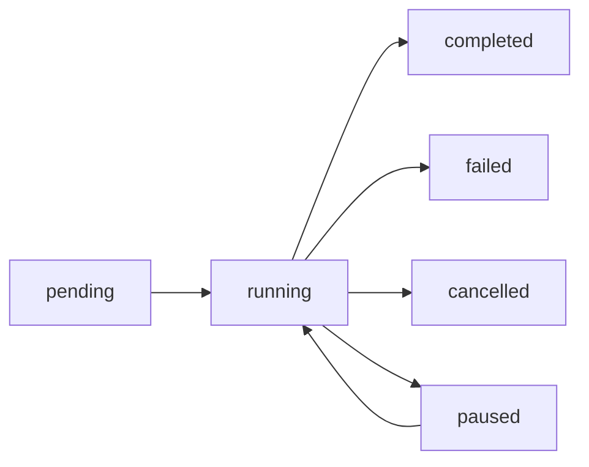

The `JobStatus` model provides real-time information about a running, completed, or failed crawl job. It is returned by job creation, status check, and control endpoints.

## Fields

<ResponseField name="id" type="string" required>
  Unique identifier for the job (UUID v4 format).
  
  **Example:** `"a3d4f1c2-8b9e-4567-8901-234567890abc"`
</ResponseField>

<ResponseField name="status" type="string" required>
  Current status of the job. Possible values:
  - `pending` - Job created but not yet started
  - `running` - Job is actively processing pages
  - `paused` - Job is paused (can be resumed)
  - `completed` - Job finished successfully
  - `failed` - Job encountered an error
  - `cancelled` - Job was cancelled by user
</ResponseField>

<ResponseField name="pages_completed" type="integer" default={0}>
  Number of pages that have been processed (successfully or with errors).
  
  This counter increments for:
  - Successfully processed pages
  - Pages that failed processing
  - Pages skipped due to duplicate content
  - Pages blocked by bot detection
</ResponseField>

<ResponseField name="pages_total" type="integer" default={0}>
  Total number of pages discovered and queued for processing.
  
  This value is set after the discovery and filtering phases complete. It may be `0` during the early stages of a job.
</ResponseField>

<ResponseField name="current_url" type="string | null" default={null}>
  The URL currently being processed, if available.
  
  **Example:** `"https://docs.example.com/getting-started"`
  
  This field is `null` when:
  - Job is in init/discovery/filtering phase
  - Job is completed or failed
  - Job is paused
</ResponseField>

## Status Lifecycle



## Example Responses

### Job Creation Response

```json
{
  "id": "a3d4f1c2-8b9e-4567-8901-234567890abc",
  "status": "pending",
  "pages_completed": 0,
  "pages_total": 0,
  "current_url": null
}
```

### Job in Progress

```json
{
  "id": "a3d4f1c2-8b9e-4567-8901-234567890abc",
  "status": "running",
  "pages_completed": 15,
  "pages_total": 42,
  "current_url": "https://docs.example.com/api/authentication"
}
```

### Completed Job

```json
{
  "id": "a3d4f1c2-8b9e-4567-8901-234567890abc",
  "status": "completed",
  "pages_completed": 42,
  "pages_total": 42,
  "current_url": null
}
```

### Paused Job

```json
{
  "id": "a3d4f1c2-8b9e-4567-8901-234567890abc",
  "status": "paused",
  "pages_completed": 20,
  "pages_total": 42,
  "current_url": null
}
```

### Failed Job

```json
{
  "id": "a3d4f1c2-8b9e-4567-8901-234567890abc",
  "status": "failed",
  "pages_completed": 8,
  "pages_total": 42,
  "current_url": null
}
```

## Usage in Endpoints

The `JobStatus` model is returned by the following endpoints:

- `POST /jobs` - Create a new job
- `GET /jobs/{job_id}/status` - Get current job status
- `POST /jobs/{job_id}/cancel` - Cancel a job (returns final status)
- `POST /jobs/{job_id}/pause` - Pause a job
- `POST /jobs/{job_id}/resume` - Resume a paused job
- `POST /jobs/resume-from-state` - Resume from checkpoint

## Progress Calculation

You can calculate job progress as a percentage:

```javascript
const progress = status.pages_total > 0 
  ? (status.pages_completed / status.pages_total) * 100 
  : 0;
```

## Polling vs SSE

<Info>
  While you can poll `GET /jobs/{job_id}/status` for updates, the recommended approach is to use the [Server-Sent Events (SSE) endpoint](/api-reference/endpoints/job-events) at `GET /jobs/{job_id}/events` for real-time updates.
</Info>

## Notes

<Note>
  The `pages_completed` counter includes all processed pages, regardless of outcome. For detailed statistics including success/failure breakdown, subscribe to the job events stream or check the final `job_done` event.
</Note>

<Warning>
  Completed jobs are automatically cleaned up after `JOB_TTL_SECONDS` (default: 3600 seconds / 1 hour). After cleanup, status requests will return 404.
</Warning>

## Related Models

- [JobRequest](/api-reference/models/job-request) - Create a new job
- [Job Events](/api-reference/models/job-events) - Real-time event stream
