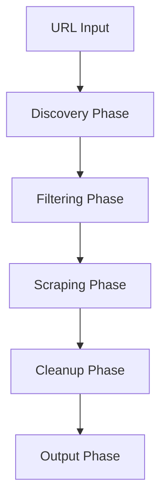

# Welcome to Docrawl

Docrawl is a FastAPI-powered web crawler designed specifically for documentation sites. It combines intelligent URL discovery, multi-strategy scraping, and LLM-powered cleanup to convert any documentation website into clean, structured Markdown files.

## Key Features

<CardGroup cols={2}>
  <Card title="Intelligent Discovery" icon="magnifying-glass">
    Cascade URL discovery via sitemap → navigation → recursive crawl
  </Card>
  <Card title="LLM-Powered Cleanup" icon="brain">
    Filter URLs and clean Markdown with Ollama, OpenRouter, OpenCode, or LM Studio
  </Card>
  <Card title="5-Level Fallback Chain" icon="layer-group">
    Cache → Native MD → Proxy → HTTP → Playwright scraping strategies
  </Card>
  <Card title="Real-Time Progress" icon="chart-line">
    SSE streaming with live phase updates and synthwave UI
  </Card>
  <Card title="Docker Ready" icon="docker">
    Single command deployment with docker compose
  </Card>
  <Card title="Pause & Resume" icon="pause">
    Checkpoint-based persistence for long-running crawls
  </Card>
</CardGroup>

## How It Works

Docrawl follows a sophisticated 6-phase pipeline to extract and clean documentation:



1. **Discovery** - Find all documentation URLs via sitemap parsing, navigation extraction, or recursive crawling
2. **Filtering** - Remove non-documentation URLs using deterministic rules, robots.txt, and LLM classification
3. **Scraping** - Extract content using the optimal strategy from 5 fallback levels
4. **Cleanup** - Remove navigation residue and noise with LLM-powered 3-tier classification
5. **Output** - Save as organized Markdown files or structured JSON

## Multi-Provider LLM Support

Docrawl supports **four LLM providers** out of the box:

<CardGroup cols={2}>
  <Card title="Ollama" icon="server">
    Local models running on your machine - completely free
  </Card>
  <Card title="OpenRouter" icon="globe">
    Access to 100+ models including free options
  </Card>
  <Card title="OpenCode" icon="code">
    Premium models including Claude and GPT optimized for code
  </Card>
  <Card title="LM Studio" icon="desktop">
    Local server with OpenAI-compatible API
  </Card>
</CardGroup>

Use **different providers for different roles** - for example, a fast local model for URL filtering and a powerful cloud model for markdown cleanup.

## Use Cases

<AccordionGroup>
  <Accordion title="Documentation Migration">
    Migrate legacy documentation to a new platform by crawling the old site and exporting clean Markdown files ready for import.
  </Accordion>
  <Accordion title="Competitive Analysis">
    Study competitor documentation structure and content by extracting it into analyzable Markdown or JSON format.
  </Accordion>
  <Accordion title="Knowledge Base Indexing">
    Convert documentation sites into structured data for RAG systems, search engines, or AI training datasets.
  </Accordion>
  <Accordion title="Documentation Backup">
    Create versioned backups of documentation sites with checkpoint-based pause/resume for large sites.
  </Accordion>
</AccordionGroup>

## Quick Example

Here's a minimal request to crawl a documentation site:

```bash
curl -X POST http://localhost:8002/api/jobs \
  -H "Content-Type: application/json" \
  -d '{
    "url": "https://docs.example.com",
    "crawl_model": "ollama/mistral:7b",
    "pipeline_model": "ollama/qwen2.5:14b",
    "max_depth": 3,
    "language": "en"
  }'
```

The API returns a job ID. Stream real-time progress via SSE:

```bash
curl http://localhost:8002/api/jobs/{job_id}/events
```

Output files are saved to `./data/example.com/` with clean, organized Markdown.

## What's Next?

<CardGroup cols={2}>
  <Card title="Quickstart" icon="rocket" href="/quickstart">
    Get up and running in 5 minutes
  </Card>
  <Card title="LLM Providers" icon="brain" href="/guides/llm-providers">
    Configure Ollama, OpenRouter, or OpenCode
  </Card>
  <Card title="API Reference" icon="code" href="/api-reference/endpoints/jobs">
    Explore the full REST API
  </Card>
  <Card title="Architecture" icon="sitemap" href="/advanced/architecture">
    Deep dive into the pipeline
  </Card>
</CardGroup>
